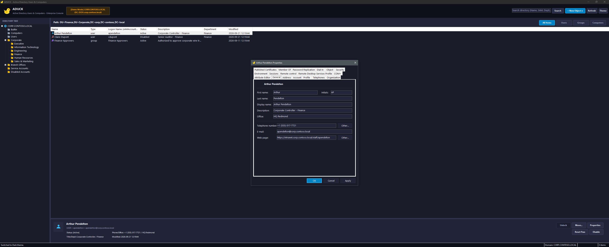

# ADUCK — Active Directory Users and Computers

A modern, fast, Windows Forms GUI-based replacement for Microsoft's classic Active Directory Users and Computers (`dsa.msc`) MMC snap-in, designed natively in PowerShell with a **default dark mode** tailored for Windows Server and admin workstations.



---

## Key Features

- **Default Dark Mode**:
  - Deep slate and dark navy palette (`#12141D` / `#1A1C2A`) with high-contrast text and sleek sky-blue accents.
  - Native Windows 10/11 & Windows Server dark title bar integration via Win32 DWM (`DwmSetWindowAttribute`).
  - Custom `DarkToolStripRenderer` for clean borderless dark context menus, dropdowns, and status strips (no Windows 98/classic gray bevels).
  - Quick theme toggle button (`☀️`/`🌙`) to switch between Dark and Light mode on the fly.
- **App Mascot & Crisp Custom Vector Icons**:
  - Duck mascot app icon and dynamically rendered, anti-aliased glyphs for Domains, OUs, Containers, Users (Active, Disabled, Locked Out), Security Groups, and Computers.
- **Interactive Directory Navigation**:
  - **Left Pane (Directory Hierarchy)**: Expandable TreeView displaying domain root, standard containers (`Users`, `Computers`, `Builtin`), and nested Organizational Units (OUs).
  - **Right Pane (Object List)**: Detailed view with column sorting, breadcrumb path, and quick type filter chips (`All`, `Users`, `Groups`, `Computers`).
- **Instant Search & Filter**:
  - Real-time search bar across names, logon names (`sAMAccountName`), emails, and departments with Enter-key support.
- **Quick Inspector Drawer**:
  - Immediate preview card for the selected directory object showing avatar, status badges (`[Active]`, `[Disabled]`, `[Locked Out]`), phone, email, password status, and last logon timestamps without needing to open dialogs.
  - Instant one-click action buttons directly on the drawer.
- **Comprehensive Administrative Actions**:
  - **Reset Password**: Modal dialog supporting custom password, "User must change password at next logon", and "Unlock account".
  - **Enable / Disable**: Toggle user and computer account status with immediate UI feedback.
  - **Unlock Account**: Fast unlocking of locked-out accounts.
  - **Move Object**: Interactive OU tree destination picker.
  - **Delete Object**: Safe confirmation dialog.
  - **Full Properties Dialogs**:
    - **18 User Tabs**: Full MMC layout including General, Account, Profile, Organization, Dial-in, Password Replication, and full canonical LDAP Attribute Editor.
    - **11 Computer Tabs**: General, Operating System, Member Of, Delegation, Password Replication, Location, Managed By, Dial-in, Object, Security, Attribute Editor.
    - **7 Group Tabs**: General, Members, Member Of, Managed By, Object, Security, Attribute Editor.
  - **Object Creation**: Fast creation dialogs for New User, New Group (Scope & Type), New Computer, and New OU.
- **Automatic Dual-Engine (Live AD & Demo Mode)**:
  - Automatically connects to live Active Directory if joined to a domain (via `ActiveDirectory` PowerShell module or native .NET ADSI).
  - Automatically loads a rich interactive simulated enterprise directory (`CORP.CONTOSO.LOCAL` with over 20+ realistic users, OUs, and groups) when offline, on standalone machines, or when `-Demo` is specified. All CRUD operations function live in memory.

---

## Quick Start

### Launching the Application

Simply run the script with PowerShell:

```powershell
powershell.exe -ExecutionPolicy Bypass -File .\ADUCK.ps1
```

### Launch Options & Parameters

| Parameter | Type | Description |
| :--- | :--- | :--- |
| `-Demo` | Switch | Forces interactive simulated demo mode (`CORP.CONTOSO.LOCAL`). Ideal for testing without touching production AD. |
| `-Domain <string>` | String | Target Active Directory domain name (e.g. `corp.contoso.com`). |
| `-Server <string>` | String | Target Domain Controller (e.g. `dc01.corp.contoso.com`). |
| `-Credential <PSCredential>` | Credential | Optional credentials to connect to the directory. |
| `-LightMode` | Switch | Starts the application in light theme instead of the default dark mode. |

#### Examples

```powershell
# Run in Demo mode on any machine
.\ADUCK.ps1 -Demo

# Target a specific domain and controller
.\ADUCK.ps1 -Domain "contoso.com" -Server "dc01.contoso.com"

# Launch in light theme
.\ADUCK.ps1 -LightMode
```

---

## Verification & Testing

Run the included automated test suite to validate PowerShell AST syntax, WinForms theme/control initialization, vector icon generation, and directory operations:

```powershell
powershell.exe -ExecutionPolicy Bypass -File .\Run-Tests.ps1
```
